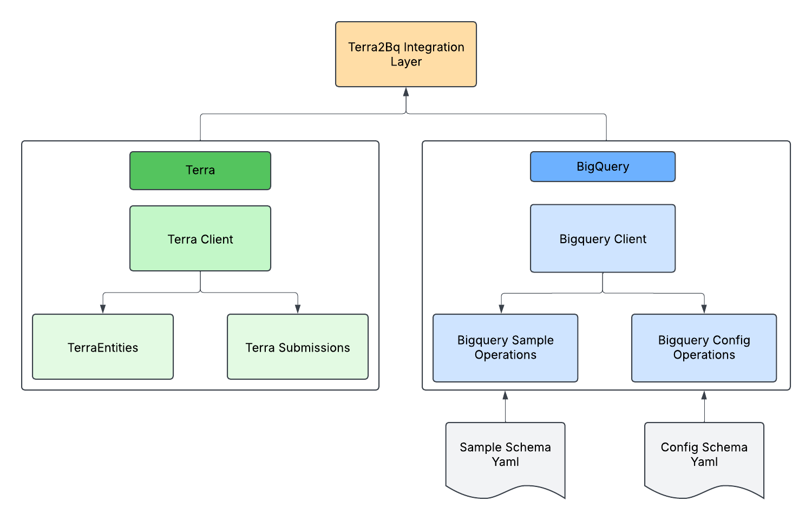

# forklift
Automation Data Movement and Integration Library for Sample Datastores

🏗️🏗️🏗️🏗️🏗️🏗️🏗️🏗️🏗️🏗️🏗️🏗️🏗️🏗️🏗️🏗️🏗️🏗️🏗️🏗️🏗️🏗️🏗️🏗️🏗️🏗️🏗️🏗️🏗️

🚧 Under Construction 🚧

### Getting Setup

This project uses `poetry` for project management 

If you don't have poetry present, please install it with:
`pip install poetry`

Then run poetry env activate which will create your environment:
`poetry env activate`

Finally, install the dependencies listed in `poetry.lock` utilizing:
`poetry install`

The dependencies will be installed based on the locked versions in the `poetry.lock` file, since I already ran `poetry install` and pushed the lock file. For more information on poetry, read here: https://python-poetry.org/docs/basic-usage/

### Note
This is a first time dump of everything I've been putting together for an automation library for our data movement needs

### Overview

# TODO:
- Add target workspace entry for Terra class
- Add test suite for bigquery layer
- Add Terra2Bq integration layer
- Add module level logging and better error handling
- Define key yaml tags with team
- Test scope of bigquery range
- Test, Test, Test

Biggest lift to do is scope out what we actually want to include for the bigquery samples class and how we want to name key identifiers in the yamls, develops some internal schema for that, and then after that we should be flying. 

🥶