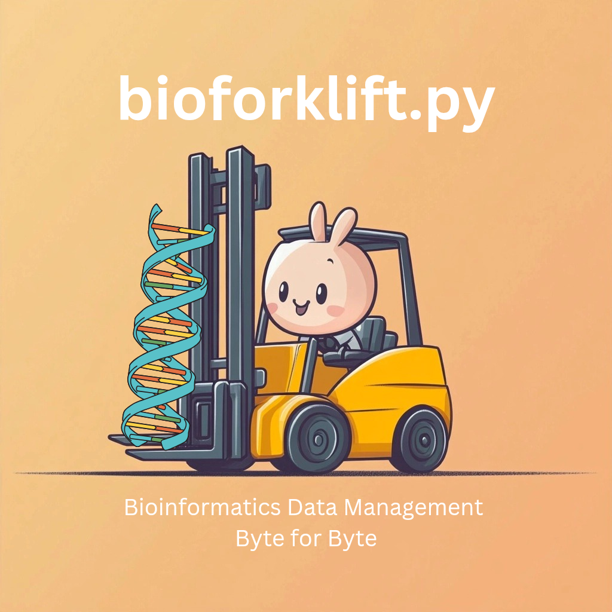

# bioforklift

**bioforklift** is a Python library meant for seamlessly integrating data transfer between Biguery and Terra bioinformatics platform. Our goal is to simplify data automation for large scale sample processing worklfows for pathogen detection. 

<div style="text-align: center;">
  
</div>


## Overview

bioforklift provides a comprehensive solution for managing the flow of genomic sequening data and metadata between Terra workspaces and BigQuery databases. It offers a set of tools to:

- Download data from Terra to BigQuery
- Upload data from BigQuery to Terra
- Submit and monitor Terra workflows
- Synchronize metadata between platforms
- Generate alerts and reports

## Key Features

- **Bidirectional Integration**: Move data seamlessly between Terra and BigQuery
- **Workflow Management**: Submit, track, and monitor Terra workflows
- **Metadata Synchronization**: Keep your metadata in sync across workspaces and datatables
- **Configurable Operations**: Use YAML-based configuration for flexible setup
- **Alerting System**: Get notifications about workflow status through Slack

## Modules

They key modules for Forkflift include the following:

- **Terra2BQ**: Integration layer that combines BigQuery and Terra operations
- **BigQuery**: Interface with Google BigQuery for data storage and retrieval, generalizing common retrieval patterns
- **Terra**: Connect to Terra for bioinformatics workflow execution
- **Alerting**: Send notifications and reports to Slack

The goal is to make sure we can expand and integrate other data stores or alerting systems as needed to have a complete ecosystem for large scale bioinformatics data flows.

## Setup Instructions

### Prerequisites

Before using bioforklift, ensure you have:

1. Python 3.9 or higher
2. Access to Google Cloud Platform (GCP) and BigQuery
3. Access to Terra workspace(s)
4. Appropriate permissions for both platforms

### Installation

You can install bioforklift using pip:
```bash
pip install bioforklift
```

Or install from source:

```bash
git clone https://github.com/theiagen/bioforklift.git
cd bioforklift
pip install -e .
```

### Authentication

#### Google Cloud Authentication

bioforklift requires authentication to access Google Cloud and Terra. There are two main methods for authentication:

1. **Using Application Default Credentials**:

    ```bash
    gcloud auth application-default login
    ```

2. **Using a Service Account Key**:

    ```python
    # You can provide a path to your service account JSON key file
    google_credentials_json = "path/to/your/service-account-key.json"
    ```

#### Terra Authentication

Authentication for Terra is handled through the same Google credentials used for BigQuery.

## License

GNU GENERAL PUBLIC LICENSE
